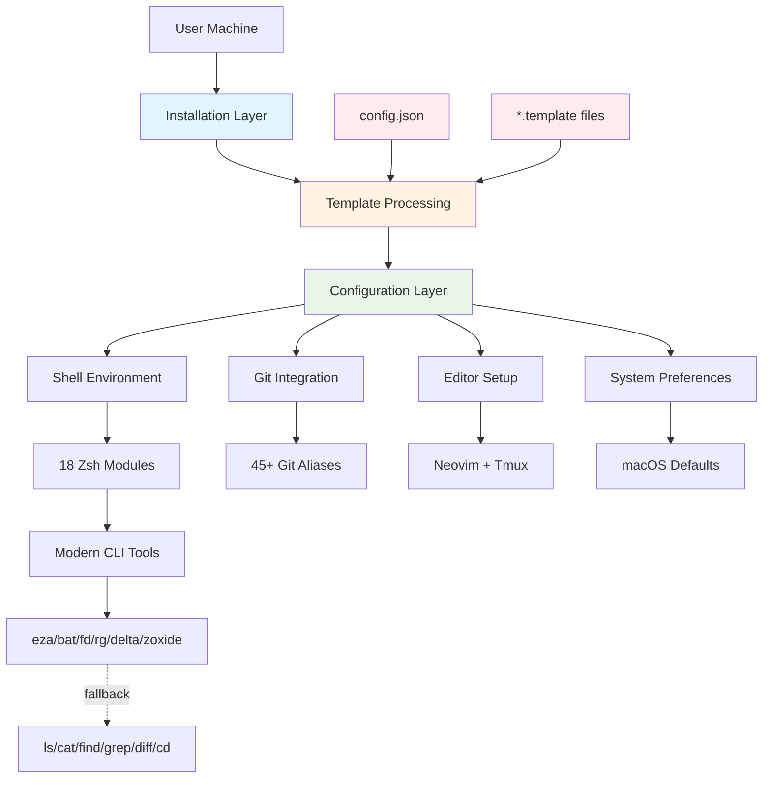
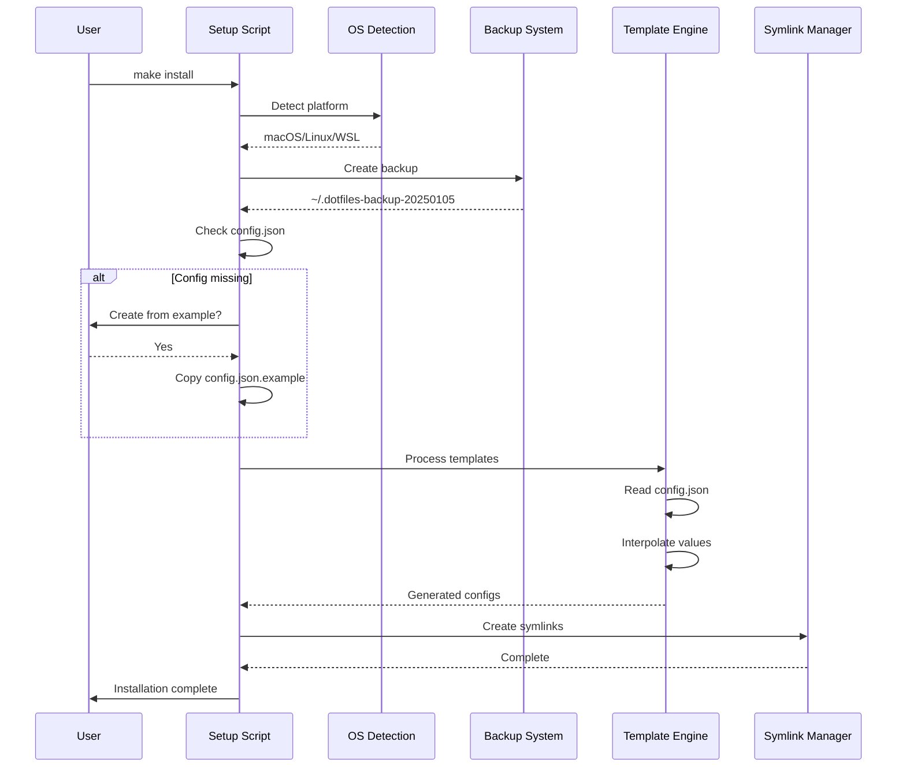

# Building a Production-Ready Dotfiles System: Architecture and Lessons Learned

## Introduction

Managing development environments across multiple machines is a common challenge. Most developers eventually create dotfiles repositories, but many struggle with the same core problems: hardcoded personal information leaking into version control, fragile installation scripts that break on different platforms, and configurations that become unmaintainable over time.

This post examines a production-grade dotfiles system designed to address these issues. The system manages shell configurations, editor setups, Git workflows, and system preferences across macOS, Linux, and WSL. More importantly, it demonstrates architectural patterns that make dotfiles maintainable, testable, and secure.

The key insight: treat your dotfiles like production software. Apply the same engineering discipline—modularity, testing, documentation, and separation of concerns—that you would to any critical infrastructure.

## The Problem Space

After working across different machines and teams, several pain points became clear:

1. **Secret Management**: Developers accidentally commit personal email addresses, SSH key paths, or API tokens in their public dotfiles repositories.

2. **Platform Fragmentation**: A configuration that works on macOS breaks on Linux. Package managers differ. Path conventions vary. Conditional logic becomes unwieldy.

3. **Dependency Hell**: Modern CLI tools improve productivity but aren't universally available. Configurations break when dependencies are missing.

4. **Maintenance Burden**: As configurations grow, understanding what each piece does becomes difficult. Removing or updating components risks breaking the entire setup.

5. **Onboarding Friction**: Setting up a new machine takes hours of manual work, even with existing dotfiles.

A robust dotfiles system needs to solve all of these while remaining approachable enough that you'll actually maintain it.

## Design Philosophy

The architecture rests on several core principles:

**Template-Driven Configuration**: Separate structure from personalization. Version control tracks templates, not the personalized outputs. A JSON configuration file provides the data layer.

**Progressive Enhancement**: The system works immediately with minimal dependencies and sensible defaults. Optional features enhance the experience without being required.

**Graceful Degradation**: Modern CLI tools improve productivity, but the system falls back to traditional utilities when they're unavailable. No hard dependencies on external tools.

**Modular Components**: Each subsystem (shell, Git, editor, terminal multiplexer) operates independently. Users can skip components they don't need.

**Cross-Platform Abstraction**: A unified interface across operating systems. Platform-specific behavior is encapsulated in detection libraries.

**Quality-First Development**: Automated testing, pre-commit hooks, and CI/CD pipelines ensure reliability. Treat your dotfiles with the same rigor as production code.

## Architecture Overview

The system is organized into distinct layers, each with clear responsibilities:



### Directory Structure

The repository follows a clear organizational pattern:

```
dotfiles/
├── config/              # Configuration modules (41 files)
│   ├── zsh/            # Shell environment (18 modules)
│   ├── git/            # Git configuration
│   ├── nvim/           # Editor setup
│   ├── tmux/           # Terminal multiplexer
│   └── ssh/            # SSH client templates
├── install/            # Setup automation (9 scripts)
├── lib/                # Utility libraries
├── bin/                # Custom executables (5 utilities)
├── tests/              # Quality assurance (22 tests)
└── config.json.example # Template configuration
```

Each directory has a single, well-defined purpose. There's no ambiguity about where a new configuration should go.

## The Template System: Solving the Secret Problem

The template system is the architectural linchpin. It solves the persistent problem of managing personal information without hardcoding it in version-controlled files.

### How It Works

1. **Configuration Declaration**: A `config.json` file (gitignored) contains personal data:

```json
{
  "user": {
    "name": "Jane Smith",
    "email": "jane@example.com",
    "editor": "nvim",
    "terminal": "iTerm2"
  },
  "git": {
    "signing_key": "~/.ssh/id_ed25519_github.pub",
    "gpg_program": "/usr/bin/ssh-keygen"
  },
  "ssh": {
    "keys": {
      "github": "~/.ssh/id_ed25519_github",
      "gitlab": "~/.ssh/id_ed25519_gitlab",
      "personal": "~/.ssh/id_rsa_personal"
    },
    "servers": {
      "prod-server": {
        "host": "prod.example.com",
        "user": "deploy",
        "port": 22
      }
    }
  },
  "paths": {
    "workspace": "~/workspace",
    "projects": "~/projects"
  }
}
```

2. **Template Files**: Configuration files use placeholder syntax:

```bash
# gitconfig.template
[user]
    name = {{ GIT_USER_NAME }}
    email = {{ GIT_USER_EMAIL }}
    signingkey = {{ GIT_SIGNING_KEY }}

[gpg]
    program = {{ GIT_GPG_PROGRAM }}

[commit]
    gpgsign = true
```

3. **Processing**: During installation, a template processor reads `config.json` and interpolates values into templates, generating the final configuration files.

4. **Isolation**: The generated files are either gitignored or symlinked outside the repository. Personal data never enters version control.

### Benefits

This approach provides several advantages over environment variables or inline conditionals:

- **Structured Data**: JSON provides validation and type safety. Complex nested data structures are natural.
- **Single Source of Truth**: All personal configuration lives in one file, easy to audit and update.
- **Graceful Onboarding**: First-time setup generates `config.json` from an example template with inline documentation.
- **IDE Support**: JSON schema validation can catch errors before installation.
- **No Magic Variables**: No reliance on environment variables that might differ across shells or contexts.

## Installation Flow

The installation process prioritizes safety and transparency:



### Key Steps

**1. OS Detection**

The system identifies the platform and architecture early:

```bash
detect_os() {
    case "$(uname -s)" in
        Darwin*)    OS="macos" ;;
        Linux*)
            if [[ -f /proc/version ]] && grep -q Microsoft /proc/version; then
                OS="wsl"
            else
                OS="linux"
            fi
            ;;
        *)          OS="unknown" ;;
    esac
    export OS
}
```

This enables conditional logic throughout the installation and runtime configuration.

**2. Automatic Backup**

Before making any changes, the system creates a timestamped backup:

```bash
backup_existing_configs() {
    local backup_dir="$HOME/.dotfiles-backup-$(date +%Y%m%d-%H%M%S)"
    mkdir -p "$backup_dir"

    for file in ~/.zshrc ~/.gitconfig ~/.vimrc; do
        if [[ -f "$file" ]]; then
            cp "$file" "$backup_dir/"
        fi
    done

    log_info "Backup created: $backup_dir"
}
```

This provides a rollback path if anything goes wrong.

**3. Dependency Installation**

Platform-specific package managers install required tools:

```bash
install_dependencies() {
    case "$OS" in
        macos)
            command -v brew >/dev/null 2>&1 || {
                log_info "Installing Homebrew..."
                /bin/bash -c "$(curl -fsSL https://raw.githubusercontent.com/Homebrew/install/HEAD/install.sh)"
            }
            brew install git zsh jq
            ;;
        linux)
            if command -v apt-get >/dev/null 2>&1; then
                sudo apt-get update
                sudo apt-get install -y git zsh jq
            elif command -v dnf >/dev/null 2>&1; then
                sudo dnf install -y git zsh jq
            fi
            ;;
    esac
}
```

**4. Template Processing**

The template engine interpolates configuration:

```bash
process_templates() {
    local config_file="$HOME/.dotfiles/config.json"

    find config -name "*.template" | while read -r template; do
        local output="${template%.template}"
        jq -r 'to_entries | map("\(.key)=\(.value)") | .[]' "$config_file" | \
        while IFS='=' read -r key value; do
            sed "s|{{ $key }}|$value|g" "$template" > "$output"
        done
    done
}
```

**5. Symlink Creation**

Configuration files are symlinked into the home directory:

```bash
create_symlinks() {
    ln -sf "$HOME/.dotfiles/config/zsh/zshrc" "$HOME/.zshrc"
    ln -sf "$HOME/.dotfiles/config/git/gitconfig" "$HOME/.gitconfig"
    ln -sf "$HOME/.dotfiles/config/nvim" "$HOME/.config/nvim"
    ln -sf "$HOME/.dotfiles/config/tmux/tmux.conf" "$HOME/.tmux.conf"
}
```

Symlinks keep the repository as the source of truth. Edits to dotfiles immediately affect the repository.

## Shell Environment: Performance and Modularity

The shell configuration demonstrates the modular design philosophy. Rather than a monolithic `.zshrc`, the system uses 18 focused modules:

### Module Organization

```bash
# zshrc (main loader)
DOTFILES_HOME="${DOTFILES_HOME:-$HOME/.dotfiles}"

# Load modules in dependency order
source "$DOTFILES_HOME/config/zsh/exports"
source "$DOTFILES_HOME/config/zsh/aliases"
source "$DOTFILES_HOME/config/zsh/functions"
source "$DOTFILES_HOME/config/zsh/completions"
source "$DOTFILES_HOME/config/zsh/prompt"
source "$DOTFILES_HOME/config/zsh/intelligent-history"
source "$DOTFILES_HOME/config/zsh/cross-platform"
source "$DOTFILES_HOME/config/zsh/performance"

# Load optional modules
[[ -f "$DOTFILES_HOME/config/zsh/personal-aliases" ]] && \
    source "$DOTFILES_HOME/config/zsh/personal-aliases"
```

Each module has a clear responsibility:

- **exports**: Environment variables and language runtime paths
- **aliases**: Command shortcuts (45+ Git aliases)
- **functions**: Utility functions (40+ organized into 10 categories)
- **completions**: Zsh completion system with caching
- **prompt**: Git-aware prompt with visual indicators
- **intelligent-history**: Deduplication and search optimization
- **cross-platform**: macOS/Linux/WSL compatibility layer
- **performance**: Lazy loading and startup optimization

### Performance Characteristics

Shell startup time directly impacts developer productivity. The configuration achieves **0.158s startup** through several techniques:

**Lazy Loading**: Heavy operations defer until first use:

```bash
# Don't load NVM immediately
nvm() {
    unset -f nvm
    export NVM_DIR="$HOME/.nvm"
    [ -s "$NVM_DIR/nvm.sh" ] && \. "$NVM_DIR/nvm.sh"
    nvm "$@"
}
```

**Completion Caching**: Completion generation is expensive. Cache it:

```bash
# Load completions once per day
autoload -Uz compinit
if [[ -n ${ZDOTDIR}/.zcompdump(#qN.mh+24) ]]; then
    compinit
else
    compinit -C
fi
```

**Conditional Feature Loading**: Skip features that aren't needed:

```bash
# Only load Docker completions if Docker is installed
if command -v docker >/dev/null 2>&1; then
    source "$DOTFILES_HOME/config/zsh/docker-completions"
fi
```

### Modern CLI Tool Integration

The configuration integrates modern alternatives to traditional Unix tools, with automatic fallbacks:

```bash
# eza (better ls) with fallback to ls
if command -v eza >/dev/null 2>&1; then
    alias ls='eza --icons --group-directories-first'
    alias ll='eza -l --icons --group-directories-first'
    alias la='eza -la --icons --group-directories-first'
    alias tree='eza --tree --icons'
else
    alias ll='ls -lh'
    alias la='ls -lah'
fi

# bat (better cat) with fallback
if command -v bat >/dev/null 2>&1; then
    alias cat='bat --style=plain --paging=never'
    alias less='bat --style=plain'
else
    alias cat='cat'
fi

# fd (better find) with fallback
if command -v fd >/dev/null 2>&1; then
    alias find='fd'
fi

# ripgrep (better grep) with fallback
if command -v rg >/dev/null 2>&1; then
    alias grep='rg'
fi

# zoxide (smarter cd) with fallback
if command -v zoxide >/dev/null 2>&1; then
    eval "$(zoxide init zsh)"
    alias cd='z'
fi
```

This approach provides the best available experience without creating hard dependencies.

## Git Workflow Integration

The Git configuration includes 45+ aliases designed for common workflows:

### Basic Operations

```bash
# gitconfig
[alias]
    # Status and info
    s = status -sb
    st = status

    # Add and commit
    a = add
    aa = add --all
    c = commit -v
    cm = commit -m
    ca = commit -av

    # Branch management
    b = branch
    ba = branch -a
    bd = branch -d
    bD = branch -D

    # Checkout
    co = checkout
    cob = checkout -b

    # Push and pull
    p = push
    pl = pull
    pom = push origin main
    plom = pull origin main

    # Diff
    d = diff
    ds = diff --staged
    dc = diff --cached

    # Log
    l = log --oneline --graph --decorate
    lg = log --graph --pretty=format:'%Cred%h%Creset -%C(yellow)%d%Creset %s %Cgreen(%cr) %C(bold blue)<%an>%Creset'
```

### Advanced Workflows

```bash
# Quick commit: stage all and commit with message
qc() {
    git add -A && git commit -m "$*"
}

# Add, commit, and push in one command
acp() {
    git add -A && git commit -m "$*" && git push
}

# Create new branch from main
gnew() {
    git checkout main && git pull && git checkout -b "$1"
}

# Clean up merged branches
git-cleanup() {
    git branch --merged | grep -v '\*\|main\|master' | xargs -n 1 git branch -d
}

# Better log formatting
gitlog() {
    git log --graph --abbrev-commit --decorate --format=format:'%C(bold blue)%h%C(reset) - %C(bold green)(%ar)%C(reset) %C(white)%s%C(reset) %C(dim white)- %an%C(reset)%C(auto)%d%C(reset)'
}
```

### Delta Integration

The configuration integrates delta for enhanced diffs:

```bash
[core]
    pager = delta

[interactive]
    diffFilter = delta --color-only

[delta]
    navigate = true
    light = false
    side-by-side = true
    line-numbers = true
    syntax-theme = Dracula

[merge]
    conflictstyle = diff3

[diff]
    colorMoved = default
```

This provides side-by-side diffs, syntax highlighting, and improved merge conflict visualization.

## Quality Assurance

The system includes comprehensive testing and validation:

### Pre-commit Hooks

25 pre-commit hooks ensure code quality:

```yaml
# .pre-commit-config.yaml
repos:
  # Basic file checks
  - repo: https://github.com/pre-commit/pre-commit-hooks
    hooks:
      - id: trailing-whitespace
      - id: end-of-file-fixer
      - id: check-merge-conflict
      - id: check-symlinks
      - id: detect-private-key
      - id: check-added-large-files
        args: ['--maxkb=500']

  # Shell script linting
  - repo: https://github.com/shellcheck-py/shellcheck-py
    hooks:
      - id: shellcheck
        args: ['-x', '-e', 'SC1090,SC1091']

  # Shell script formatting
  - repo: https://github.com/scop/pre-commit-shfmt
    hooks:
      - id: shfmt
        args: ['-i', '4', '-ci', '-w']

  # Markdown linting
  - repo: https://github.com/markdownlint/markdownlint
    hooks:
      - id: markdownlint
        args: ['--fix']

  # Custom validators
  - repo: local
    hooks:
      - id: check-alias-conflicts
        name: Check for alias conflicts
        entry: bin/check-alias-conflicts
        language: script
        pass_filenames: false

      - id: validate-structure
        name: Validate dotfiles structure
        entry: tests/test-structure.sh
        language: script
        pass_filenames: false
```

### Automated Testing

22 tests validate critical functionality:

```bash
# tests/test-all.sh
run_test() {
    local test_name="$1"
    local test_func="$2"

    if $test_func; then
        log_success "✓ $test_name"
        ((TESTS_PASSED++))
    else
        log_error "✗ $test_name"
        ((TESTS_FAILED++))
    fi
}

# OS detection tests
run_test "OS detection works" test_os_detection
run_test "Architecture detection works" test_arch_detection

# Template processing tests
run_test "Template placeholders are replaced" test_template_processing
run_test "Config validation works" test_config_validation

# Installation tests
run_test "Backup creation works" test_backup_creation
run_test "Symlinks are created correctly" test_symlink_creation
run_test "Dry-run doesn't modify files" test_dry_run

# Cross-platform tests
run_test "Aliases work on Linux" test_linux_aliases
run_test "Aliases work on macOS" test_macos_aliases
run_test "WSL detection works" test_wsl_detection

# Function tests
run_test "Git functions execute" test_git_functions
run_test "File operations work" test_file_functions
run_test "Tmux helpers work" test_tmux_functions
```

### CI/CD Pipeline

GitHub Actions runs tests on multiple platforms:

```yaml
# .github/workflows/test.yml
name: Test

on: [push, pull_request]

jobs:
  test:
    strategy:
      matrix:
        os: [ubuntu-latest, macos-latest]
    runs-on: ${{ matrix.os }}

    steps:
      - uses: actions/checkout@v5

      - name: Install dependencies
        run: make install-deps

      - name: Run linting
        run: make lint

      - name: Run tests
        run: make test

      - name: Test installation
        run: make install-dry-run

      - name: Security scan
        uses: gitleaks/gitleaks-action@v2
```

## Real-World Usage Patterns

The system supports several common scenarios:

### New Machine Setup

```bash
# Clone the repository
git clone https://github.com/vnykmshr/dotfiles.git ~/.dotfiles
cd ~/.dotfiles

# Preview changes without modification
make install-dry-run

# Install with automatic backup
make install

# Install modern CLI tools
make packages

# Setup development environment
make dev
```

Total setup time: 5-10 minutes, mostly automated.

### Multi-Machine Synchronization

```bash
# On machine A, make changes and push
cd ~/.dotfiles
git add -A
git commit -m "Update zsh aliases"
git push

# On machine B, sync
cd ~/.dotfiles
make sync  # Pulls changes and reinstalls
```

### Team Customization

```bash
# Fork the repository
git clone https://github.com/myorg/dotfiles.git ~/.dotfiles

# Customize config.json for team standards
vim ~/.dotfiles/config.json

# Add team-specific aliases
echo "alias deploy='kubectl apply -f k8s/'" >> ~/.dotfiles/config/zsh/personal-aliases

# Install
make install
```

### Troubleshooting and Recovery

```bash
# Something broke? Check logs
dotfiles status

# Restore from backup
make restore  # Interactive selection from available backups

# Complete reset
make reset  # Uninstall, remove configs, and reinstall
```

## Key Design Decisions and Trade-offs

Several architectural choices shape the system:

### Template System vs Environment Variables

**Decision**: Use JSON configuration with template processing rather than environment variables.

**Rationale**: Environment variables work for simple cases but become unwieldy with nested structures (SSH server configurations, multiple key paths, complex tool settings). JSON provides structure, validation, and IDE support. The trade-off is additional complexity in the installation script.

### Symlinks vs Copying

**Decision**: Symlink configuration files rather than copying them.

**Rationale**: Symlinks keep the repository as the source of truth. Edits immediately affect the repository, simplifying the development workflow. The trade-off is that some tools don't follow symlinks correctly, requiring wrapper scripts.

### Modular vs Monolithic

**Decision**: Split shell configuration into 18 modules rather than a single file.

**Rationale**: Modularity improves maintainability and allows selective loading. The trade-off is slightly more complex loading logic and a larger number of files to navigate.

### Modern Tools with Fallbacks vs Traditional Only

**Decision**: Integrate modern CLI tools but provide fallbacks to traditional utilities.

**Rationale**: Modern tools significantly improve productivity (faster search, better diffs, smarter navigation). Fallbacks ensure the shell works everywhere, even on minimal systems. The trade-off is conditional logic throughout the configuration.

### Automated Testing vs Manual Validation

**Decision**: Invest in automated tests and pre-commit hooks.

**Rationale**: Dotfiles are critical infrastructure. Breaking them can lock you out of your shell or corrupt configuration. Automated testing prevents regressions. The trade-off is initial development time and ongoing maintenance.

### Fork-and-Customize vs Universal Configuration

**Decision**: Design for forking rather than trying to create a universal configuration.

**Rationale**: Everyone's workflow is different. Attempting to support all use cases leads to bloat and complexity. The template system makes forking straightforward. The trade-off is that users can't simply clone and use it directly.

## Performance Considerations

Shell startup time accumulates across thousands of terminal sessions. Several optimizations keep startup fast:

### Lazy Loading

Defer expensive operations until first use:

```bash
# NVM is slow to initialize (~200ms)
# Load it only when needed
nvm() {
    unset -f nvm
    export NVM_DIR="$HOME/.nvm"
    [ -s "$NVM_DIR/nvm.sh" ] && \. "$NVM_DIR/nvm.sh"
    nvm "$@"
}

node() {
    unset -f node nvm
    export NVM_DIR="$HOME/.nvm"
    [ -s "$NVM_DIR/nvm.sh" ] && \. "$NVM_DIR/nvm.sh"
    node "$@"
}
```

### Completion Caching

Generate completions once per day instead of every shell:

```bash
autoload -Uz compinit
if [[ -n ${ZDOTDIR}/.zcompdump(#qN.mh+24) ]]; then
    compinit
else
    compinit -C  # Skip security check for cached completions
fi
```

### Conditional Feature Loading

Only load features that are available:

```bash
# Don't source Docker completions if Docker isn't installed
if command -v docker >/dev/null 2>&1; then
    source "$DOTFILES_HOME/config/zsh/docker-completions"
fi

# Skip Kubernetes completions if kubectl is missing
if command -v kubectl >/dev/null 2>&1; then
    source <(kubectl completion zsh)
fi
```

### Profiling

The system includes a benchmarking utility to identify bottlenecks:

```bash
# bin/shell-bench
for i in {1..10}; do
    /usr/bin/time -p zsh -i -c exit 2>&1 | grep real | awk '{print $2}'
done | awk '{sum+=$1} END {print "Average: " sum/NR "s"}'
```

Run `shell-bench` after making changes to measure impact.

## Lessons Learned

Building and maintaining this system over several years revealed several insights:

### Start Simple, Add Complexity When Needed

Early versions tried to handle every edge case upfront. This created unnecessary complexity. The better approach: start with sensible defaults and add customization only when you encounter actual friction.

### Template System Pays for Itself

The initial investment in building the template system seemed excessive for "just configuration files." In practice, it prevents accidental secret commits and makes onboarding new machines trivial. The return on investment is significant.

### Testing is Non-Negotiable

Shell scripts are notoriously fragile. Without automated testing, refactoring becomes risky and you accumulate cruft. Investing in tests enables confident iteration.

### Performance Matters More Than Expected

A 500ms startup delay seems negligible until you open dozens of terminal sessions per day. Optimizing startup time has a meaningful impact on perceived responsiveness.

### Cross-Platform Support is Worth the Effort

Even if you primarily use one operating system, occasional use of others (WSL for Windows work, Linux for servers, macOS for development) makes cross-platform support valuable. The abstraction layer isn't that complex.

### Documentation Degrades Without Enforcement

Configuration files accumulate cruft. Comments become outdated. Pre-commit hooks that validate structure and require documentation for new functions keep things maintainable.

### Modular Design Enables Experimentation

Being able to disable individual modules makes experimentation safe. You can try new tools or workflows without risking your entire configuration.

## When to Use This Approach

This architecture is appropriate when:

- You work across multiple machines regularly
- You value consistency in your development environment
- You're comfortable with shell scripting and Git workflows
- You want to treat your dotfiles as production infrastructure
- You need to manage sensitive configuration data
- You work on multiple operating systems
- You want a foundation for team-wide standardization

This approach is overkill when:

- You work on a single machine with no backup/sync needs
- You prefer minimal configuration
- You don't work with sensitive information
- You want a zero-configuration experience
- Shell startup time isn't a concern

## Future Directions

Several areas offer opportunities for enhancement:

**Configuration Validation**: Add JSON schema validation for `config.json` to catch errors at installation time rather than runtime.

**Encrypted Secrets Management**: Integrate with tools like `sops` or `age` for encrypting sensitive values in `config.json`.

**Plugin System**: Create a plugin architecture for third-party extensions without modifying core files.

**Interactive Setup Wizard**: Guide first-time users through `config.json` creation with validation and suggestions.

**Performance Monitoring**: Add telemetry to track which modules impact startup time on real-world systems.

**Team Sync Mechanism**: Add support for team-wide configurations that merge with personal customizations.

## Conclusion

Building a robust dotfiles system requires applying software engineering discipline to what many treat as throwaway scripts. The payoff is a reliable, maintainable development environment that works consistently across machines and operating systems.

The key architectural decisions—template-based configuration, modular design, graceful degradation, and automated testing—solve the common problems that plague dotfiles repositories. These patterns are transferable to any dotfiles system, regardless of specific tools or preferences.

Most importantly, treating your dotfiles as production infrastructure changes how you approach them. You document changes, test rigorously, and think carefully about backward compatibility. Your development environment becomes something you can rely on rather than something you occasionally fix when it breaks.

The complete implementation is available at [vnykmshr/dotfiles](https://github.com/vnykmshr/dotfiles). Fork it, understand what each piece does, and adapt it to your workflow. The value is in the patterns and structure, not the specific configurations.

---

*About the architecture: This system has been refined over several years of daily use across macOS, Linux, and WSL environments. It currently manages development environments for full-stack engineering work involving multiple languages, frameworks, and deployment targets.*
